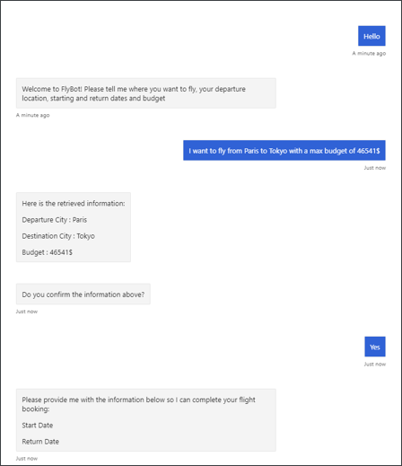
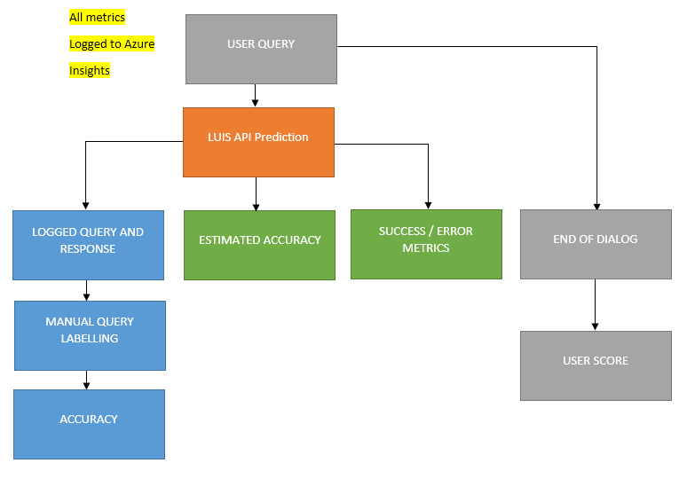
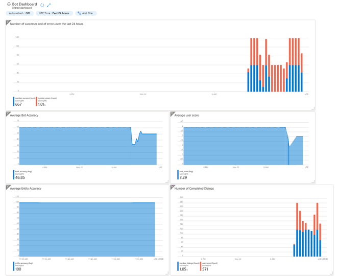
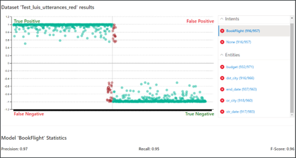

# FlyBot

A responsive Flight Booking Chatbot using an advanced language recognition algorithm (Azure LUIS).

The challenge of this project was to connect the Chatbot itself (built with Microsot BotFramework SDK)
with the LUIS model developped on Azure.

The bot is able to **recognize user inputs** and translate them into data that can be used to book a flight.

A critical requirement was to develop a dashboard with **real-time performance monitoring capabilities**
to ensure that the bot was meeting key requirements. This was built thanks to the Azure Monitor and 
the Application Insights platform using the Logs and Metrics features.

## Useful Links

* [Project presentation (Powerpoint)](Project_Presentation.pptx)
* [Jupyter Notebook (Model training)](Notebook.ipynb)
* [Bot Dialog File](bot/dialogs/user_profile_dialog.py)

## Screenshots

### Bot Dialog

### Logged Metrics

### Monitoring Dashboard

### Model Performance

## Libraries / Packages Used

* [Microsoft BotFramework SDK for Python](https://github.com/microsoft/botbuilder-python)
* [Azure Cognitive LUIS for Python](https://github.com/microsoft/Cognitive-LUIS-Python)
* [Azure Monitor](https://azure.microsoft.com/fr-fr/products/monitor/)
* [Opencensus](https://opencensus.io/)
* Pandas / Numpy 

## Developed By

Octave Antoni

[Connect with me on Linkedin](https://www.linkedin.com/in/octave-antoni/)

## License

    Copyright 2023 Octave Antoni

    Licensed under the Apache License, Version 2.0 (the "License");
    you may not use this file except in compliance with the License.
    You may obtain a copy of the License at

        http://www.apache.org/licenses/LICENSE-2.0

    Unless required by applicable law or agreed to in writing, software
    distributed under the License is distributed on an "AS IS" BASIS,
    WITHOUT WARRANTIES OR CONDITIONS OF ANY KIND, either express or implied.
    See the License for the specific language governing permissions and
    limitations under the License.